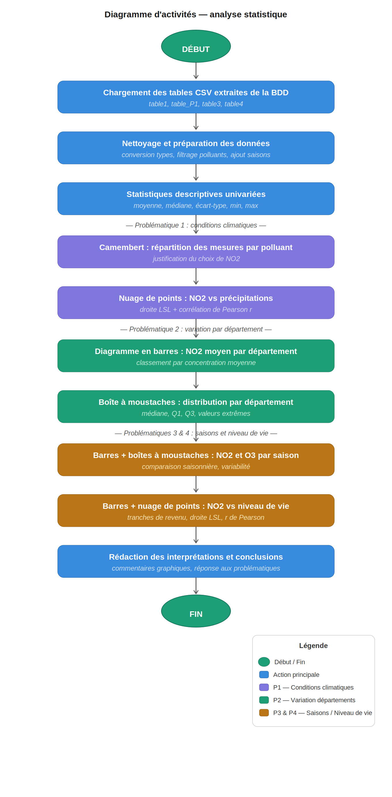

```{r setup, include=FALSE}
knitr::opts_chunk$set(echo = TRUE, warning = FALSE, message = FALSE)
```

```{r packages, include=FALSE}
# Installer les packages :
# install.packages(c("tidyverse", "ggplot2"))
library(tidyverse)
library(ggplot2)
```

# Diagramme d'activités



# Base de données

## Construction de la base de données

Ce projet porte sur l'étude de la pollution de l'air en Occitanie. Les données nous ont été fournies sous la forme de trois fichiers CSV :

- **mesures_occitanie_journaliere_pollution.csv** : 231 843 mesures journalières de 8 polluants (NO, NO2, NOX, O3, PM10, PM2.5, SO2, H2S) relevées dans 36 communes d'Occitanie entre 2022 et 2026.
- **donnees_geo_climatiques.csv** : données géographiques et climatiques (température, vent, précipitations, insolation, altitude…) pour 34 935 communes françaises.
- **donnees_socio_economiques.csv** : données socio-économiques (niveau de vie médian, population, pourcentage d'appartements…) pour 34 875 communes françaises.

Nous avons construit la base de données en Python à l'aide des bibliothèques **pandas** et **sqlite3**, via le script `creation_bdd.py`. La construction suit quatre étapes successives.

### Étape 1 — Lecture des fichiers CSV

Les trois fichiers CSV sont chargés en mémoire avec `pandas.read_csv()`. On obtient trois DataFrames :

```python
df_pollution = pd.read_csv("mesures_occitanie_journaliere_pollution.csv")
df_geo       = pd.read_csv("donnees_geo_climatiques.csv", low_memory=False)
df_socio     = pd.read_csv("donnees_socio_economiques.csv")
```

Le paramètre `low_memory=False` est nécessaire pour le fichier géographique car certaines colonnes contiennent des types mixtes.

### Étape 2 — Harmonisation des codes INSEE

Un problème de type a été identifié : dans le fichier de pollution, le champ `code_insee_com` est stocké en entier (`int`), alors que dans les deux autres fichiers il est stocké en texte (`str`). Cette différence aurait empêché les jointures SQL de fonctionner. Nous avons donc converti toutes les colonnes en `Int64` avec `pd.to_numeric()` :

```python
df_pollution['code_insee_com'] = pd.to_numeric(
    df_pollution['code_insee_com'], errors='coerce'
).astype('Int64')
# idem pour df_geo et df_socio
```

Une vérification a ensuite confirmé que les 36 codes communes de pollution sont bien présents dans les deux autres fichiers.

### Étape 3 — Insertion dans la base SQLite

Une base de données SQLite est créée et les trois DataFrames sont insérés comme tables avec `to_sql()` :

```python
conn = sqlite3.connect("bdd_pollution_occitanie.db")
df_pollution.to_sql("mesures_pollution",       conn, if_exists="replace", index=False)
df_geo.to_sql("donnees_geo_climatiques",       conn, if_exists="replace", index=False)
df_socio.to_sql("donnees_socio_economiques",   conn, if_exists="replace", index=False)
```

Le paramètre `if_exists="replace"` permet de recréer la table si le script est relancé.

### Étape 4 — Extraction des tables d'analyse par requêtes SQL

Cinq tables ont été extraites via `pd.read_sql_query()` et exportées en CSV pour être utilisées dans R :

| Table CSV | Contenu | Utilisée pour |
|---|---|---|
| `table_analyse_univariee.csv` | Statistiques descriptives globales par polluant | Étude univariée |
| `table_stats_par_commune_polluant.csv` | Statistiques descriptives par commune et polluant | Répartition des mesures par polluant (appui Problématique 1) |
| `table_climat_pollution.csv` | Mesures journalières + variables climatiques (jointure) | Problématique 1 |
| `table_pollution_par_departement.csv` | Concentrations mensuelles agrégées par département | Problématiques 2 et 3 |
| `table_pollution_socioeco.csv` | Concentrations + données socio-économiques (jointure) | Problématique 4 |

**Polluants exclus** : SO2 (3 067 mesures, 2 communes) et H2S (3 061 mesures, 2 communes) sont trop peu représentés pour être analysés de façon fiable. Les analyses portent donc sur les **6 polluants principaux** : NO, NO2, NOX, O3, PM10, PM2.5.

## Requêtes SQL pour chaque problématique

### Table pour la Problématique 1 — Climat et pollution

Cette table est construite par une **jointure LEFT JOIN** entre les mesures de pollution et les données géo-climatiques sur `code_insee_com`. Elle conserve toutes les mesures journalières et y ajoute les variables climatiques (précipitations, vent, température…) de la commune correspondante :

```sql
SELECT
    p.nom_dept, p.nom_com, p.code_insee_com,
    p.nom_poll AS polluant, p.valeur_poll AS concentration,
    p.jour, p.mois, p.annee,
    g.Force_vent_med  AS force_vent,
    g.RR_med          AS precipitations,
    g.Tmin_med        AS temperature_min,
    g.Tmax_med        AS temperature_max
FROM mesures_pollution p
LEFT JOIN donnees_geo_climatiques g
    ON p.code_insee_com = g.code_insee_com
ORDER BY p.nom_com, p.nom_poll, p.annee, p.mois, p.jour
```

### Table pour les Problématiques 2 et 3 — Départements et saisons

Cette table agrège les mesures par département, polluant, année et mois avec `GROUP BY`. Elle calcule la concentration moyenne, minimale et maximale pour chaque groupe :

```sql
SELECT
    p.nom_dept, p.nom_poll AS polluant,
    p.annee, p.mois,
    ROUND(AVG(p.valeur_poll), 2) AS conc_moyenne,
    ROUND(MIN(p.valeur_poll), 2) AS conc_min,
    ROUND(MAX(p.valeur_poll), 2) AS conc_max,
    COUNT(*) AS nb_mesures
FROM mesures_pollution p
GROUP BY p.nom_dept, p.code_insee_com, p.nom_poll, p.annee, p.mois
ORDER BY p.nom_dept, p.nom_poll, p.annee, p.mois
```

### Table pour la Problématique 4 — Niveau de vie et pollution

Cette table combine les mesures de pollution avec les données socio-économiques via une **jointure LEFT JOIN**, puis agrège par commune et polluant pour obtenir une concentration moyenne par commune :

```sql
SELECT
    p.nom_dept, p.nom_com, p.code_insee_com,
    p.nom_poll AS polluant,
    ROUND(AVG(p.valeur_poll), 2) AS conc_moyenne,
    s.niveau_vie_median_2021     AS niveau_vie,
    s.population_municipale_2023 AS population
FROM mesures_pollution p
LEFT JOIN donnees_socio_economiques s
    ON p.code_insee_com = s.code_insee_com
GROUP BY p.code_insee_com, p.nom_poll
ORDER BY p.nom_com, p.nom_poll
```

---

# Statistique descriptive

## Identification de problématiques statistiques

À partir des données disponibles, nous avons identifié quatre problématiques statistiques :

**Problématique 1** : Les conditions climatiques (précipitations, vent) influencent-elles les concentrations de polluants en Occitanie ?

**Problématique 2** : Les niveaux de pollution diffèrent-ils d'un département à l'autre en Occitanie ?

**Problématique 3** : Les concentrations de polluants varient-elles selon les saisons ?

**Problématique 4** : Existe-t-il un lien entre le niveau de vie des communes et leur niveau de pollution ?

---

## Étude univariée des polluants

### Chargement des données

```{r chargement_etude_univariee}
# Chargement de la table d'analyse univariée
df_univariate <- read.csv("table_analyse_univariee.csv")

# Polluants à étudier
polluants_ok <- c("NO", "NO2", "NOX", "O3", "PM10", "PM2.5")

# Filtrer sur les polluants principaux
df_univariate <- df_univariate %>% filter(polluant %in% polluants_ok)
```

### Tableau récapitulatif des statistiques descriptives

Le tableau ci-dessous présente pour chaque polluant les statistiques descriptives fondamentales :

```{r tableau_univarie}
df_univariate %>%
  select(polluant, nb_observations, moyenne, minimum, maximum, ecart_type, 
         nb_communes, nb_stations, nb_annees) %>%
  rename(
    "Polluant" = polluant,
    "N observations" = nb_observations,
    "Moyenne" = moyenne,
    "Min" = minimum,
    "Max" = maximum,
    "Écart-type" = ecart_type,
    "Communes" = nb_communes,
    "Stations" = nb_stations,
    "Années" = nb_annees
  ) %>%
  knitr::kable(
    caption = "Statistiques descriptives par polluant (Occitanie 2022-2026)",
    align = "lccccccc",
    format = "html"
  ) %>%
  kableExtra::kable_styling(bootstrap_options = c("striped", "hover"))
```

### Visualisations univariées

#### Graphique 1 — Concentration moyenne par polluant

```{r moyennes_univarie, fig.width=8, fig.height=5}
df_univariate %>%
  ggplot(aes(x = reorder(polluant, moyenne), y = moyenne, fill = polluant)) +
  geom_col(alpha = 0.7, color = "black") +
  labs(
    title = "Concentration moyenne par polluant",
    x = "Polluant", y = "Concentration (µg/m³)",
    fill = "Polluant"
  ) +
  theme_minimal(base_size = 12) +
  theme(
    plot.title = element_text(face = "bold", hjust = 0.5),
    legend.position = "none"
  )
```

#### Graphique 2 — Écart-type par polluant

```{r ecarttype_univarie, fig.width=8, fig.height=5}
df_univariate %>%
  ggplot(aes(x = reorder(polluant, ecart_type), y = ecart_type, fill = polluant)) +
  geom_col(alpha = 0.7, color = "black") +
  labs(
    title = "Variabilité (écart-type) par polluant",
    x = "Polluant", y = "Écart-type (µg/m³)",
    fill = "Polluant"
  ) +
  theme_minimal(base_size = 12) +
  theme(
    plot.title = element_text(face = "bold", hjust = 0.5),
    legend.position = "none"
  )
```

#### Graphique 3 — Couverture spatiale et temporelle

```{r couverture_univarie, fig.width=9, fig.height=5}
df_univariate %>%
  pivot_longer(cols = c(nb_communes, nb_stations, nb_annees),
               names_to = "couverture", values_to = "nombre") %>%
  mutate(couverture = recode(couverture,
    nb_communes = "Communes (n)",
    nb_stations = "Stations (n)",
    nb_annees = "Années (n)"
  )) %>%
  ggplot(aes(x = polluant, y = nombre, fill = couverture)) +
  geom_col(position = "dodge", alpha = 0.7, color = "black") +
  labs(
    title = "Couverture spatiale et temporelle par polluant",
    x = "Polluant", y = "Nombre",
    fill = "Type de couverture"
  ) +
  theme_minimal(base_size = 12) +
  theme(
    plot.title = element_text(face = "bold", hjust = 0.5),
    legend.position = "bottom"
  )
```

### Observations et conclusions de l'étude univariée

- Les **polluants NOx** (NO, NO2, NOX) présentent les concentrations les plus élevées, avec des moyennes bien supérieures aux autres.
- L'**ozone (O3)** montre une variabilité importante (fort écart-type), indiquant une forte dépendance aux conditions météorologiques.
- Les **particules fines (PM2.5 et PM10)** ont une étendue moins large mais des écarts-types significatifs.
- Tous les polluants couvrent au minimum **30 communes** et **12 stations** sur **5 années** d'observation, garantissant une couverture spatiale et temporelle suffisante pour les analyses subséquentes.

---

## Réponses aux problématiques identifiées

```{r chargement_donnees}
# Chargement des tables extraites de la BDD
df_p1 <- read.csv("table_climat_pollution.csv")
df_t1 <- read.csv("table_stats_par_commune_polluant.csv")
df_t3 <- read.csv("table_pollution_par_departement.csv")
df_t4 <- read.csv("table_pollution_socioeco.csv")

# Conversion de niveau_vie en numérique
df_t4$niveau_vie <- as.numeric(df_t4$niveau_vie)

# Filtrage sur les 6 polluants principaux
polluants_ok <- c("NO", "NO2", "NOX", "O3", "PM10", "PM2.5")

df_p1 <- df_p1 %>% filter(polluant %in% polluants_ok)
df_t1 <- df_t1 %>% filter(polluant %in% polluants_ok)
df_t3 <- df_t3 %>% filter(polluant %in% polluants_ok)
df_t4 <- df_t4 %>% filter(polluant %in% polluants_ok)
```

---

### Problématique 1 — Les conditions climatiques influencent-elles la pollution ?

#### Description des variables

Nous étudions le lien entre les **précipitations** (quantitative continue, en mm) et la **concentration de NO2** (quantitative continue, en µg/m³).

```{r stats_p1}
df_p1 %>%
  filter(polluant == "NO2") %>%
  summarise(
    Nb_mesures       = n(),
    Moyenne_NO2      = round(mean(concentration, na.rm = TRUE), 2),
    Mediane_NO2      = round(median(concentration, na.rm = TRUE), 2),
    Ecart_type_NO2   = round(sd(concentration, na.rm = TRUE), 2),
    Moyenne_pluie_mm = round(mean(precipitations, na.rm = TRUE), 2)
  ) %>%
  knitr::kable(caption = "Statistiques descriptives — NO2 et précipitations")
```

#### Graphique 1 — Diagramme en camembert : répartition des mesures par polluant

Avant d'analyser le lien avec le climat, on visualise la **répartition des mesures** entre les différents polluants pour justifier le choix du NO2 comme polluant d'étude.

```{r camembert_p1, fig.width=7, fig.height=5}
# Nombre de mesures par polluant
nb_mesures <- df_t1 %>%
  group_by(polluant) %>%
  summarise(total = sum(nb_mesures)) %>%
  mutate(pct = round(total / sum(total) * 100, 1),
         label = paste0(polluant, "\n", pct, "%"))

ggplot(nb_mesures, aes(x = "", y = total, fill = polluant)) +
  geom_bar(stat = "identity", width = 1, color = "white") +
  coord_polar(theta = "y") +
  geom_text(aes(label = label),
            position = position_stack(vjust = 0.5), size = 3.5) +
  labs(
    title = "Répartition des mesures par polluant",
    subtitle = "Occitanie — 2022-2026",
    fill = "Polluant"
  ) +
  theme_void(base_size = 13) +
  theme(plot.title = element_text(face = "bold", hjust = 0.5),
        plot.subtitle = element_text(hjust = 0.5, color = "grey50"))
```

#### Graphique 2 — Courbe : évolution mensuelle du NO2 et des précipitations

```{r courbe_p1, fig.width=9, fig.height=5}
df_p1 %>%
  filter(polluant == "NO2") %>%
  group_by(mois) %>%
  summarise(
    moy_no2   = round(mean(concentration,  na.rm = TRUE), 2),
    moy_pluie = round(mean(precipitations, na.rm = TRUE), 2),
    .groups = "drop"
  ) %>%
  mutate(mois = factor(mois, levels = 1:12,
                       labels = c("Jan","Fév","Mar","Avr","Mai","Jun",
                                  "Jul","Aoû","Sep","Oct","Nov","Déc"))) %>%
  pivot_longer(cols = c(moy_no2, moy_pluie),
               names_to = "variable", values_to = "valeur") %>%
  mutate(variable = recode(variable,
    moy_no2   = "NO2 (µg/m³)",
    moy_pluie = "Précipitations (mm)"
  )) %>%
  ggplot(aes(x = mois, y = valeur, color = variable, group = variable)) +
  geom_line(linewidth = 1.2) +
  geom_point(size = 3) +
  facet_wrap(~ variable, scales = "free_y") +
  scale_color_manual(values = c("NO2 (µg/m³)"        = "steelblue",
                                "Précipitations (mm)" = "darkgreen")) +
  labs(
    title    = "Évolution mensuelle du NO2 et des précipitations",
    subtitle = "Occitanie — moyenne sur 2022-2026",
    x = "Mois", y = "Valeur moyenne"
  ) +
  theme_bw(base_size = 12) +
  theme(legend.position = "none",
        strip.text = element_text(face = "bold"))
```

#### Interprétation

Le camembert montre que le NO2 représente la part la plus importante des mesures (21%), ce qui justifie son choix comme polluant principal d'étude. La courbe mensuelle met en évidence une **tendance opposée** entre les deux variables : le NO2 est élevé en hiver (janvier-février) quand les précipitations sont faibles, et diminue en été quand les pluies augmentent. Cela s'explique par le fait que **la pluie lave l'atmosphère** et réduit les polluants en suspension.

---

### Problématique 2 — La pollution diffère-t-elle selon les départements ?

#### Description des variables

La variable explicative est le **département** (qualitative nominale, 12 modalités). La variable à expliquer est la **concentration mensuelle moyenne de NO2** (quantitative continue, en µg/m³).

```{r stats_p2}
df_t3 %>%
  filter(polluant == "NO2") %>%
  group_by(Departement = nom_dept) %>%
  summarise(
    Moyenne  = round(mean(conc_moyenne, na.rm = TRUE), 2),
    Mediane  = round(median(conc_moyenne, na.rm = TRUE), 2),
    Minimum  = round(min(conc_moyenne, na.rm = TRUE), 2),
    Maximum  = round(max(conc_moyenne, na.rm = TRUE), 2)
  ) %>%
  arrange(desc(Moyenne)) %>%
  knitr::kable(caption = "Concentration mensuelle de NO2 par département (µg/m³)")
```

#### Graphique 1 — Diagramme en barres : concentration moyenne par département

```{r barres_p2, fig.width=9, fig.height=5}
df_t3 %>%
  filter(polluant == "NO2") %>%
  group_by(nom_dept) %>%
  summarise(moy = round(mean(conc_moyenne, na.rm = TRUE), 2)) %>%
  mutate(nom_dept = str_to_title(nom_dept)) %>%
  ggplot(aes(x = reorder(nom_dept, moy), y = moy, fill = moy)) +
  geom_bar(stat = "identity", color = "black", width = 0.7) +
  geom_text(aes(label = moy), hjust = -0.2, size = 3.5) +
  scale_fill_gradient(low = "#AED6F1", high = "#1A5276",
                      name = "µg/m³") +
  coord_flip() +
  labs(
    title    = "Concentration moyenne de NO2 par département",
    subtitle = "Occitanie — 2022-2026",
    x        = "",
    y        = "Concentration moyenne NO2 (µg/m³)"
  ) +
  theme_bw(base_size = 12) +
  theme(legend.position = "none")
```

#### Graphique 2 — Histogramme : distribution du NO2 par département

```{r histo_p2, fig.width=11, fig.height=7}
df_t3 %>%
  filter(polluant == "NO2") %>%
  mutate(nom_dept = str_to_title(nom_dept)) %>%
  ggplot(aes(x = conc_moyenne, fill = nom_dept)) +
  geom_histogram(bins = 20, color = "white", show.legend = FALSE) +
  facet_wrap(~ nom_dept, scales = "free_y") +
  labs(
    title    = "Distribution des concentrations mensuelles de NO2 par département",
    subtitle = "Occitanie — 2022-2026",
    x        = "Concentration mensuelle NO2 (µg/m³)",
    y        = "Nombre de mois"
  ) +
  theme_bw(base_size = 11) +
  theme(strip.text = element_text(face = "bold"))
```

#### Interprétation

Le diagramme en barres montre clairement que les **Pyrénées-Orientales** (Perpignan), la **Haute-Garonne** (Toulouse) et l'**Hérault** (Montpellier) présentent les concentrations moyennes de NO2 les plus élevées. L'histogramme complète cette analyse en montrant la **distribution** des valeurs mensuelles : les départements urbains ont des distributions étalées vers la droite, traduisant des épisodes de pollution ponctuels importants. À l'inverse, la **Lozère** et l'**Ariège**, peu peuplées et rurales, affichent des distributions resserrées vers les faibles valeurs.

---

### Problématique 3 — La pollution varie-t-elle selon les saisons ?

#### Description des variables

La variable explicative est la **saison** (qualitative ordinale, 4 modalités). Les variables à expliquer sont les concentrations de **NO2** et **O3** (quantitatives continues, en µg/m³).

```{r stats_p3}
df_p1 %>%
  mutate(saison = case_when(
    mois %in% c(12, 1, 2)  ~ "Hiver",
    mois %in% c(3, 4, 5)   ~ "Printemps",
    mois %in% c(6, 7, 8)   ~ "Ete",
    mois %in% c(9, 10, 11) ~ "Automne"
  )) %>%
  filter(polluant %in% c("NO2", "O3")) %>%
  group_by(Polluant = polluant, Saison = saison) %>%
  summarise(
    Moyenne    = round(mean(concentration, na.rm = TRUE), 2),
    Mediane    = round(median(concentration, na.rm = TRUE), 2),
    Ecart_type = round(sd(concentration, na.rm = TRUE), 2),
    .groups    = "drop"
  ) %>%
  arrange(Polluant, Saison) %>%
  knitr::kable(caption = "Concentrations de NO2 et O3 par saison (µg/m³)")
```

#### Graphique 1 — Diagramme en barres : concentration moyenne par saison

```{r barres_p3, fig.width=8, fig.height=5}
df_p1 %>%
  mutate(saison = case_when(
    mois %in% c(12, 1, 2)  ~ "Hiver",
    mois %in% c(3, 4, 5)   ~ "Printemps",
    mois %in% c(6, 7, 8)   ~ "Ete",
    mois %in% c(9, 10, 11) ~ "Automne"
  ),
  saison = factor(saison, levels = c("Hiver", "Printemps", "Ete", "Automne"))
  ) %>%
  filter(polluant %in% c("NO2", "O3")) %>%
  group_by(polluant, saison) %>%
  summarise(moy = round(mean(concentration, na.rm = TRUE), 2), .groups = "drop") %>%
  ggplot(aes(x = saison, y = moy, fill = saison)) +
  geom_bar(stat = "identity", color = "black", width = 0.6) +
  geom_text(aes(label = moy), vjust = -0.5, size = 3.5) +
  facet_wrap(~ polluant, scales = "free_y") +
  scale_fill_manual(values = c(
    "Hiver"     = "#AED6F1",
    "Printemps" = "#A9DFBF",
    "Ete"       = "#FAD7A0",
    "Automne"   = "#F1948A"
  )) +
  labs(
    title    = "Concentration moyenne de NO2 et O3 par saison",
    subtitle = "Occitanie — mesures journalières 2022-2026",
    x = "", y = "Concentration moyenne (µg/m³)"
  ) +
  theme_bw(base_size = 12) +
  theme(legend.position = "none",
        strip.text = element_text(face = "bold"))
```

#### Graphique 2 — Courbe d'évolution mensuelle : NO2 et O3

```{r courbe_p3, fig.width=9, fig.height=5}
df_p1 %>%
  filter(polluant %in% c("NO2", "O3")) %>%
  group_by(polluant, mois) %>%
  summarise(moy = round(mean(concentration, na.rm = TRUE), 2), .groups = "drop") %>%
  mutate(mois = factor(mois, levels = 1:12,
                       labels = c("Jan","Fév","Mar","Avr","Mai","Jun",
                                  "Jul","Aoû","Sep","Oct","Nov","Déc"))) %>%
  ggplot(aes(x = mois, y = moy, color = polluant, group = polluant)) +
  geom_line(linewidth = 1.2) +
  geom_point(size = 3) +
  scale_color_manual(values = c("NO2" = "steelblue", "O3" = "darkorange")) +
  labs(
    title    = "Évolution mensuelle des concentrations de NO2 et O3",
    subtitle = "Occitanie — moyenne sur 2022-2026",
    x        = "Mois",
    y        = "Concentration moyenne (µg/m³)",
    color    = "Polluant"
  ) +
  theme_bw(base_size = 12)
```

#### Interprétation

Les deux graphiques se complètent. Le diagramme en barres montre clairement les **moyennes par saison** : le NO2 est maximal en hiver (21,5 µg/m³) et minimal en été (13,5 µg/m³), tandis que l'O3 suit le schéma inverse avec un pic estival. La courbe mensuelle précise cette tendance en montrant l'**évolution progressive** mois par mois : le NO2 atteint son pic en janvier-février, puis décroît jusqu'en juillet-août, tandis que l'O3 culmine en juin-juillet. Ces profils s'expliquent par la chimie atmosphérique : le NO2 s'accumule en hiver (moins de vent, chauffage), tandis que l'O3 se forme par réaction photochimique sous l'effet du soleil estival.

---

### Problématique 4 — Le niveau de vie influence-t-il la pollution ?

#### Description des variables

La variable explicative est le **niveau de vie médian** de la commune en 2021 (quantitative continue, en €/an). La variable à expliquer est la **concentration moyenne de NO2** (quantitative continue, en µg/m³). L'échantillon comprend 36 communes d'Occitanie.

```{r stats_p4}
df_t4 %>%
  filter(polluant == "NO2", !is.na(niveau_vie)) %>%
  summarise(
    Nb_communes    = n(),
    Moy_NO2        = round(mean(conc_moyenne, na.rm = TRUE), 2),
    Moy_niveau_vie = round(mean(niveau_vie, na.rm = TRUE), 0),
    Min_niveau_vie = min(niveau_vie, na.rm = TRUE),
    Max_niveau_vie = max(niveau_vie, na.rm = TRUE),
    r_Pearson      = round(cor(niveau_vie, conc_moyenne,
                               use = "complete.obs"), 3)
  ) %>%
  knitr::kable(caption = "Statistiques descriptives — NO2 et niveau de vie")
```

#### Graphique 1 — Diagramme en barres : NO2 moyen par tranche de niveau de vie

```{r barres_p4, fig.width=8, fig.height=5}
df_t4 %>%
  filter(polluant == "NO2", !is.na(niveau_vie)) %>%
  mutate(tranche_vie = cut(niveau_vie,
    breaks = c(0, 18000, 21000, 24000, Inf),
    labels = c("< 18 000 €", "18-21 000 €", "21-24 000 €", "> 24 000 €")
  )) %>%
  group_by(tranche_vie) %>%
  summarise(moy_no2 = round(mean(conc_moyenne, na.rm = TRUE), 2)) %>%
  ggplot(aes(x = tranche_vie, y = moy_no2, fill = tranche_vie)) +
  geom_bar(stat = "identity", color = "black", width = 0.6) +
  geom_text(aes(label = moy_no2), vjust = -0.5, size = 4) +
  scale_fill_brewer(palette = "Blues") +
  labs(
    title    = "Concentration moyenne de NO2 par tranche de niveau de vie",
    subtitle = "36 communes d'Occitanie",
    x        = "Niveau de vie médian",
    y        = "Concentration moyenne NO2 (µg/m³)"
  ) +
  theme_bw(base_size = 13) +
  theme(legend.position = "none")
```

#### Graphique 2 — Nuage de points : NO2 vs niveau de vie

```{r scatter_p4, fig.width=7, fig.height=5}
df_t4_no2 <- df_t4 %>%
  filter(polluant == "NO2", !is.na(niveau_vie), !is.na(conc_moyenne))

ggplot(df_t4_no2, aes(x = niveau_vie, y = conc_moyenne)) +
  geom_point(color = "steelblue", size = 3, alpha = 0.8) +
  labs(
    title    = "Concentration de NO2 en fonction du niveau de vie",
    subtitle = "36 communes d'Occitanie",
    x        = "Niveau de vie médian (€/an)",
    y        = "Concentration moyenne NO2 (µg/m³)"
  ) +
  theme_bw(base_size = 13)
```

#### Interprétation

Le diagramme en barres montre que les communes avec un niveau de vie **inférieur à 18 000 €/an** ont en moyenne plus de NO2, mais la différence entre les tranches n'est pas régulière. Le nuage de points confirme l'absence de lien visuel clair : les points sont dispersés sans tendance nette. Par exemple, des communes riches comme Blagnac (25 350 €) ont une pollution élevée à cause de leur proximité avec l'aéroport de Toulouse, tandis que des communes modestes en zone rurale sont peu polluées. C'est donc la **localisation urbaine et le trafic** qui expliquent la pollution davantage que le niveau de vie.

---

# Conclusion

Ce projet nous a permis d'étudier la qualité de l'air en Occitanie à travers quatre problématiques statistiques complémentaires. Les principaux résultats sont les suivants :

- Les **précipitations** réduisent modérément les concentrations de NO2 (r = -0,21) : la pluie agit comme un nettoyant naturel de l'atmosphère.
- La **pollution varie fortement selon les départements** : les Pyrénées-Orientales, la Haute-Garonne et l'Hérault présentent des niveaux de NO2 bien supérieurs aux départements ruraux comme la Lozère.
- Les **saisons jouent un rôle majeur et opposé** selon le polluant : le NO2 est plus élevé en hiver (accumulation), tandis que l'O3 est maximal en été (formation photochimique).
- Le **niveau de vie** n'est pas corrélé à la pollution au NO2. C'est la densité urbaine et le trafic routier qui apparaissent comme les facteurs déterminants.
